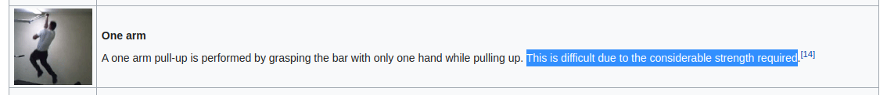

# Training Guide

Found a great training guide from the Navy Seals for training. Most of the guide is just tables that
I thought should be automated to make a seemingly curated viewing experience. The guide can be found
at [SWCC GUIDE](https://www.sealswcc.com/training/navy-seal-swcc-physical-training-guide.html). Odd
weeks prior to week 26 use Example 1; even weeks prior to week 27 use Example 2; odd weeks after
week 26 use Example 3; and even weeks after week 27 use Example 4.

## Building

The guide can be built using the command `make`. Cross training is something that should be done
everyday, according to the guide, but does not need to be done twice a day. Reps (i.e. push ups,
situps, and pull ups) can be done twice a day. First, as part of that day's reps, and second as part
of that week's reps. Both of these can be edited in [custom.c](custom.c).

## Running

Currently, the guide is run using `./guide`, followed by the week and the day. A valid utilization
of the guide would be `./guide 7 Sunday` for the Sunday of the 7th week of the training. You can
also use characters from `MTWtHFSsU` format, so `./guide 7 U` would give the same output as `./guide
7 Sunday`.

## TODO

TODO is kept in [txt/TODO.md](txt/TODO.md).

## License

This project is licensed under the [MIT license](license.txt), except for the data outputted by
`--guide`, which is public domain because it comes from the United States Navy.
